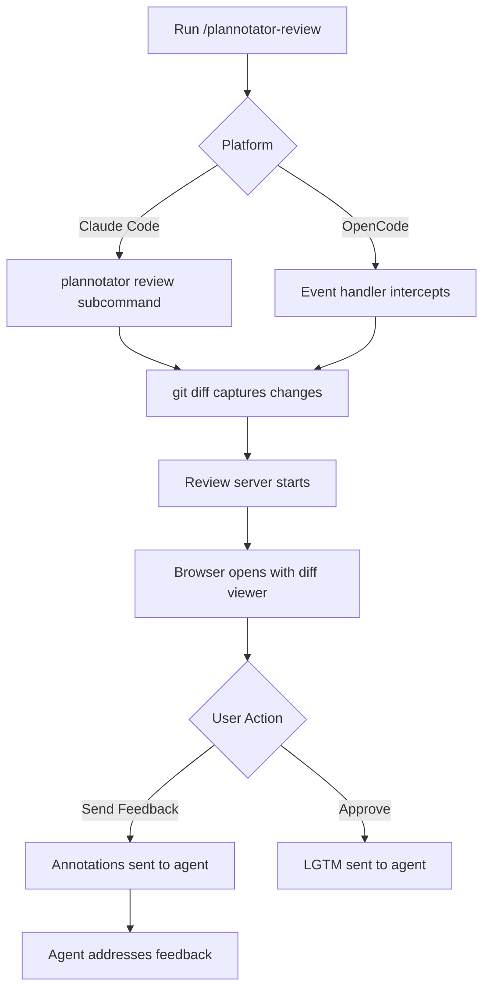

The Code Review feature lets you visually review git diffs, add annotations, and send structured feedback to your AI agent. Instead of describing changes in chat, show exactly what you want with inline comments and code suggestions.

## How It Works

### Workflow



### Command

In your AI agent session:

```bash
/plannotator-review
```

This triggers:
1. `git diff` captures unstaged changes
2. Review server starts on random port (or fixed port in remote mode)
3. Browser opens with interactive diff viewer
4. You annotate the diff and send feedback
5. Agent receives structured review comments

<Note>
  **Works with any changes**: Reviews unstaged changes by default. Stage specific files first to review only those changes.
</Note>

## Review Interface

### Diff Viewer

The review UI (`packages/review-editor/components/DiffViewer.tsx`) displays:

- **File tree**: All changed files with modification indicators
- **Split/unified view toggle**: Choose your preferred diff style
- **Syntax highlighting**: Language detection for code context
- **Line numbers**: Both old and new line numbers for precise reference
- **Annotation markers**: Visual indicators for comments and suggestions

### View Modes

<Tabs>
  <Tab title="Split View">
    Side-by-side comparison:
    - Left: Original code (deletions)
    - Right: New code (additions)
    - Perfect for comparing logic changes
    - Easier to see before/after state
  </Tab>
  
  <Tab title="Unified View">
    Inline diff format:
    - Red lines: Deletions with `-` prefix
    - Green lines: Additions with `+` prefix
    - Gray lines: Unchanged context
    - Compact, git-style presentation
  </Tab>
</Tabs>

<Tip>
  **Powered by @pierre/diffs**: The diff viewer uses the `@pierre/diffs` React library for high-quality, interactive diffs.
</Tip>

## Annotation Types

Three types of code annotations (`packages/ui/types.ts:58`):

```typescript
type CodeAnnotationType = 'comment' | 'suggestion' | 'concern';

interface CodeAnnotation {
  id: string;
  type: CodeAnnotationType;
  filePath: string;
  lineStart: number;
  lineEnd: number;
  side: 'old' | 'new';        // Maps to 'deletions' | 'additions'
  text?: string;              // Comment text
  suggestedCode?: string;     // For suggestions
  originalCode?: string;      // Original selected lines
  createdAt: number;
  author?: string;
}
```

### Comment

**Purpose**: Explain why a change is needed or point out issues

**Usage**:
1. Select one or more lines in the diff
2. Click **Comment** in the annotation toolbar
3. Enter your feedback (e.g., "This should handle null values")
4. Click **Add Comment**

**Example**:
```typescript
// Selected code:
const user = await db.users.findOne({ id });

// Comment annotation:
"Add error handling if user is not found"
```

### Suggestion

**Purpose**: Propose specific code changes with inline diff preview

**Usage**:
1. Select the code to modify
2. Click **Suggestion** in the annotation toolbar  
3. Edit the code in the suggestion modal
4. See a live diff preview of your suggestion
5. Click **Add Suggestion**

**Example**:
```typescript
// Original code:
const data = JSON.parse(response);

// Suggested code:
try {
  const data = JSON.parse(response);
} catch (error) {
  console.error('Failed to parse response:', error);
  return null;
}

// The agent sees both versions with a diff
```

<Info>
  **Suggestion Modal**: Uses Monaco editor (VS Code's editor) for syntax highlighting and multi-line editing. Your suggestion is diffed against the original selection.
</Info>

### Concern

**Purpose**: Flag potential issues without proposing specific changes

**Usage**:
1. Select problematic code
2. Click **Concern** in the annotation toolbar
3. Describe the issue (e.g., "Potential race condition here")
4. Click **Add Concern**

**Example**:
```typescript
// Selected code:
let counter = 0;
setInterval(() => counter++, 1000);

// Concern annotation:
"Shared mutable state - not safe in concurrent environment"
```

## Creating Annotations

<Steps>
  <Step title="Select Lines">
    Click a line number to select it. Click and drag to select multiple lines. Works on both old (left) and new (right) sides in split view.
  </Step>
  
  <Step title="Choose Type">
    The annotation toolbar appears above your selection. Click:
    - **Comment**: Add explanatory feedback
    - **Suggestion**: Propose code changes
    - **Concern**: Flag potential issues
  </Step>
  
  <Step title="Add Details">
    For comments/concerns: Enter text describing the issue.
    For suggestions: Edit code in the modal and review the diff preview.
  </Step>
  
  <Step title="Review Placement">
    Annotations appear inline at the selected line range with color-coded indicators:
    - Blue: Comments
    - Green: Suggestions
    - Orange: Concerns
  </Step>
</Steps>

### Editing Annotations

Click any existing annotation to:
- **Edit**: Modify text or suggested code
- **Delete**: Remove the annotation
- **Navigate**: Scroll to annotation location

Annotations are listed in the Review Panel sidebar for quick access.

## Line Selection

From `packages/ui/types.ts:84`:

```typescript
interface SelectedLineRange {
  start: number;              // Starting line number
  end: number;                // Ending line number  
  side: 'deletions' | 'additions';  // Which side of the diff
  endSide?: 'deletions' | 'additions';  // For cross-side selections
}
```

**Features**:
- **Single line**: Click a line number
- **Range**: Click and drag across multiple lines
- **Side-aware**: Tracks whether selection is on old or new code
- **Visual feedback**: Selected lines highlighted with blue background

## Sending Feedback

### Send Feedback Button

Click **Send Feedback** to:
1. Export all annotations to structured format
2. Include file paths, line ranges, and annotation text
3. Send to the AI agent session
4. Agent receives actionable review comments

**Feedback Format**:
```typescript
{
  feedback: "Please address the following code review comments:",
  annotations: [
    {
      file: "src/api/users.ts",
      lines: "42-45",
      type: "suggestion",
      comment: "Add input validation",
      suggestedCode: "if (!userId) throw new Error('...');\n..."
    },
    // ... more annotations
  ]
}
```

### Approve (LGTM)

Click **Approve** to send "LGTM" (Looks Good To Me) to the agent:
- Indicates approval of all changes
- Can include optional comments
- Agent proceeds with the changes

<Warning>
  **Agent Context**: The agent receives your feedback as a message in the conversation. Make sure annotations are clear and actionable.
</Warning>

## Review Panel

The sidebar Review Panel shows:

### Annotation List
- **Grouped by type**: Comments, Suggestions, Concerns
- **File + line info**: Quick reference to location
- **Preview text**: First line of annotation
- **Click to navigate**: Scrolls to annotation in diff

### Statistics
- **Total annotations**: Count by type
- **Files reviewed**: How many files have annotations
- **Viewed files**: Track review progress

### File Filters
- **All files**: Show complete diff
- **With annotations**: Show only annotated files
- **Unviewed**: Show files not yet reviewed

## File Tree

The file tree (`packages/review-editor/components/FileTree`) displays:

- **Modification type icons**:
  - Green `+`: New file
  - Blue `M`: Modified file
  - Red `-`: Deleted file
  - Yellow `R`: Renamed file
- **Annotation count**: Badge showing number of annotations per file
- **Viewed indicator**: Checkmark for reviewed files
- **Expand/collapse**: Nested directory structure

**Mark as Viewed**:
Click the eye icon next to a file to mark it as reviewed. Helps track progress in large changesets.

## Language Detection

Automatic syntax highlighting via `detectLanguage()` (`packages/review-editor/utils/detectLanguage.ts`):

```typescript
function detectLanguage(filePath: string): string {
  const ext = filePath.split('.').pop()?.toLowerCase();
  
  const langMap: Record<string, string> = {
    ts: 'typescript',
    tsx: 'typescript',
    js: 'javascript',
    jsx: 'javascript',
    py: 'python',
    // ... more mappings
  };
  
  return langMap[ext || ''] || 'plaintext';
}
```

Supports 50+ languages including TypeScript, Python, Rust, Go, and more.

## API Endpoints

The review server (`packages/server/review.ts`) provides:

| Endpoint | Method | Purpose |
|----------|--------|--------|
| `/api/diff` | GET | Returns `{ rawPatch, gitRef, origin }` |
| `/api/feedback` | POST | Submit review with annotations and agent switch |
| `/api/image` | GET | Serve image by path query param |
| `/api/upload` | POST | Upload screenshot, returns `{ path, originalName }` |

### Diff Response

```json
{
  "rawPatch": "diff --git a/src/api.ts b/src/api.ts\nindex 123..456\n...",
  "gitRef": "HEAD",
  "origin": "claude" // or "opencode"
}
```

### Feedback Request

```json
{
  "feedback": "User review comments",
  "annotations": [
    {
      "id": "ann-1",
      "type": "suggestion",
      "filePath": "src/api.ts",
      "lineStart": 42,
      "lineEnd": 45,
      "side": "new",
      "text": "Add error handling",
      "suggestedCode": "try { ... } catch { ... }",
      "originalCode": "const result = await fetch(...);"
    }
  ],
  "agentSwitch": { /* OpenCode only */ }
}
```

## Integration with @pierre/diffs

The diff viewer uses `@pierre/diffs` React library:

```typescript
import { PatchDiff } from '@pierre/diffs/react';

<PatchDiff
  patch={rawPatch}
  diffStyle={diffStyle}  // 'split' | 'unified'
  language={detectLanguage(filePath)}
  lineAnnotations={lineAnnotations}  // Annotation metadata
  onLineSelection={handleLineSelection}
/>
```

**Features**:
- High-performance rendering for large diffs
- Interactive line selection
- Syntax highlighting integration
- Annotation overlay support

## Demo Mode

For standalone development, the review editor includes demo data (`packages/review-editor/demoData.ts`):

```typescript
export const DEMO_PATCH = `
diff --git a/src/example.ts b/src/example.ts
index 123..456
--- a/src/example.ts
+++ b/src/example.ts
@@ -1,3 +1,5 @@
-export function hello() {
-  console.log('Hello');
+export function hello(name: string) {
+  if (!name) throw new Error('Name required');
+  console.log(\`Hello, \${name}\`);
}
`;
```

Run `bun run dev:review` to test without git changes.

## Remote Sessions

For SSH/devcontainer environments:

```bash
export PLANNOTATOR_REMOTE=1
export PLANNOTATOR_PORT=19432
```

Then run `/plannotator-review`. The server will:
- Use fixed port 19432
- Skip browser opening
- Display shareable URL

**Port forwarding**:
```bash
# Forward remote port to local machine
ssh -L 19432:localhost:19432 user@remote-host
```

Access at `http://localhost:19432`.

## Keyboard Shortcuts

- **Escape**: Clear line selection
- **Click outside**: Deselect annotation
- **Up/Down arrows**: Navigate between annotations (when panel focused)
- **Enter**: Edit selected annotation

## Command Reference

### Claude Code

Slash command: `/plannotator-review`

**Command file**: `apps/hook/commands/plannotator-review.md:8`

```markdown
!`plannotator review`
```

Executes `plannotator` binary with `review` subcommand.

### OpenCode

Slash command: `/plannotator-review`

**Plugin handler**: `apps/opencode-plugin/index.ts`

Event handler intercepts command and launches review server directly.

## Best Practices

### For Comments
- Be specific about what needs to change
- Explain *why*, not just *what*
- Reference documentation or standards when applicable

### For Suggestions
- Provide complete, runnable code
- Include necessary imports or context
- Test your suggestion mentally before submitting

### For Concerns
- Identify the specific risk or issue
- Suggest areas to investigate further  
- Use when you're unsure of the best solution

### General
- Review files systematically (mark as viewed)
- Group related annotations together
- Use consistent terminology across annotations
- Include line context for multi-line changes

## Troubleshooting

### No Changes Detected

- Verify you have unstaged changes: `git status`
- Check if changes are already staged: `git diff --cached`
- Ensure you're in a git repository

### Diff Not Rendering

- Check browser console for errors
- Verify diff is valid: `git diff > test.patch`
- Try toggling between split/unified view

### Annotations Not Saving

- Check line selection is active before clicking annotation type
- Verify lines are within valid range
- Look for JavaScript errors in console

### Agent Not Receiving Feedback

- Check network tab for failed `/api/feedback` request
- Verify agent session is still active
- Try clicking "Send Feedback" again

### Language Not Detected

- File extension may not be in language map
- Add mapping in `detectLanguage()` function
- Fallback to plaintext if unsupported

## Next Steps

- Learn about [Plan Review](/features/plan-review) for reviewing agent plans
- Explore [Plan Diff](/features/plan-diff) for version comparison
- Try [Markdown Annotation](/features/markdown-annotation) for docs review