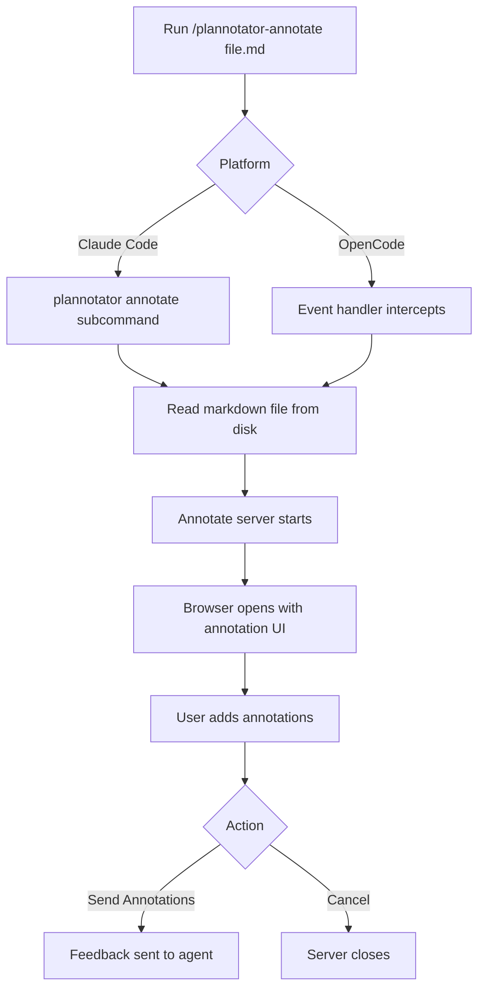

The Markdown Annotation feature lets you review and annotate any markdown file, then send structured feedback to your AI agent. Perfect for reviewing documentation, specifications, or generated content before giving it to the agent for revisions.

## How It Works

### Workflow



### Command

In your AI agent session:

```bash
/plannotator-annotate path/to/file.md
```

This triggers:
1. Server reads the markdown file from disk
2. Annotate server starts (reuses plan editor with `mode: "annotate"`)
3. Browser opens with the rendered markdown
4. You add annotations using the same tools as plan review
5. Send feedback to the agent for revisions

<Note>
  **File Path**: Can be relative to current directory or absolute path. Supports `.md` and `.mdx` files.
</Note>

## Annotation Interface

The markdown annotation UI (`packages/server/annotate.ts`) reuses the plan review editor with annotation mode enabled:

- **Rendered markdown**: Fully formatted with syntax highlighting
- **Same annotation tools**: Comments, deletions, replacements, insertions
- **Image attachments**: Attach reference images to annotations
- **Global comments**: File-level feedback
- **Table of contents**: Auto-generated navigation sidebar

<Info>
  **Shared Implementation**: The annotation server uses the same React components as plan review (`packages/ui/`, `packages/editor/`), just with different mode and data source.
</Info>

## Annotation Types

All five annotation types from plan review are available (`packages/ui/types.ts:1`):

```typescript
enum AnnotationType {
  DELETION = 'DELETION',        // Mark content for removal
  INSERTION = 'INSERTION',      // Add new content
  REPLACEMENT = 'REPLACEMENT',  // Suggest alternative text
  COMMENT = 'COMMENT',          // Add feedback without changes
  GLOBAL_COMMENT = 'GLOBAL_COMMENT' // File-level feedback
}
```

See [Plan Review](/features/plan-review) for detailed annotation type documentation.

## Creating Annotations

<Steps>
  <Step title="Select Text">
    Highlight the markdown content you want to annotate. Works across paragraphs, headings, lists, and code blocks.
  </Step>
  
  <Step title="Choose Annotation Type">
    Click the appropriate button in the floating toolbar:
    - **Comment**: Explain what needs improvement
    - **Delete**: Mark content for removal
    - **Replace**: Suggest alternative wording
    - **Insert After**: Add missing content
  </Step>
  
  <Step title="Add Feedback">
    Enter your annotation text. For replacements and insertions, provide the new content.
  </Step>
  
  <Step title="Attach Images (Optional)">
    Add screenshots, diagrams, or mockups with descriptive names like "architecture-diagram" or "ui-wireframe".
  </Step>
</Steps>

### Example Annotations

#### Comment on Technical Accuracy

```markdown
<!-- Original text -->
The API endpoint returns data in XML format.

<!-- Comment annotation -->
"Incorrect - the API returns JSON, not XML. Please verify the documentation."
```

#### Replace Unclear Wording

```markdown
<!-- Original -->
This function does stuff with the data.

<!-- Replacement -->
This function validates user input and sanitizes HTML entities.
```

#### Delete Redundant Section

```markdown
<!-- Marked for deletion -->
## Installation

To install, run npm install.

## How to Install  ← redundant heading

Run npm install to install the package.

<!-- Deletion annotation -->
"Duplicate installation section - remove this one"
```

#### Insert Missing Information

```markdown
<!-- Context text -->
## Configuration

The app requires environment variables.

<!-- Insertion after this text -->
Required variables:
- `DATABASE_URL`: PostgreSQL connection string
- `API_KEY`: External API authentication key
- `PORT`: Server port (default: 3000)
```

## Editor Modes

Choose your annotation workflow:

<Tabs>
  <Tab title="Selection Mode">
    **Default mode** - Select text, then choose annotation type from toolbar.
    
    Best for:
    - Mixed annotation types
    - Thoughtful, detailed feedback
    - Attaching images to specific annotations
  </Tab>
  
  <Tab title="Comment Mode">
    **Fast commenting** - Select text to automatically create a comment.
    
    Best for:
    - Quick feedback passes
    - Pure review (no edits)
    - Adding context and questions
  </Tab>
  
  <Tab title="Redline Mode">
    **Track changes style** - Select text to automatically mark it for deletion.
    
    Best for:
    - Cutting redundant content
    - Rapid content review
    - Legal/compliance reviews
  </Tab>
</Tabs>

Switch modes via the toolbar dropdown.

## Global Comments

For file-level feedback that doesn't relate to specific text:

1. Click **Global Comment** button in toolbar (or use the `+` icon)
2. Enter your feedback (e.g., "Add troubleshooting section", "Needs more code examples")
3. Attach reference documents or examples
4. Global comments appear at the top of the feedback export

**Use cases**:
- Structural suggestions ("Reorganize sections")
- Missing content ("Add API reference")
- Style feedback ("Use second person voice")
- General impressions ("Too technical for beginners")

## Markdown Parser

The parser (`packages/ui/utils/parser.ts:70`) splits markdown into annotatable blocks:

```typescript
function parseMarkdownToBlocks(markdown: string): Block[]
```

**Handles**:
- Headings (`#` to `######`)
- Code blocks (with language detection)
- Lists (unordered, ordered, checkboxes)
- Blockquotes (`>`)
- Horizontal rules (`---`)
- Tables
- Paragraphs (default)

**Block Structure** (`packages/ui/types.ts:40`):

```typescript
interface Block {
  id: string;
  type: 'paragraph' | 'heading' | 'blockquote' | 'list-item' | 'code' | 'hr' | 'table';
  content: string;          // Plain text content
  level?: number;           // Heading level (1-6) or list indentation
  language?: string;        // Code block language
  checked?: boolean;        // Checkbox list items
  order: number;            // Sorting order
  startLine: number;        // 1-based line number
}
```

### Frontmatter Support

YAML frontmatter is automatically extracted and preserved:

```markdown
---
title: My Document
author: Jane Doe
tags:
  - documentation
  - api
---

# Document Content
```

The parser (`packages/ui/utils/parser.ts:14`) returns:

```typescript
{
  frontmatter: {
    title: 'My Document',
    author: 'Jane Doe',
    tags: ['documentation', 'api']
  },
  content: '# Document Content\n...'
}
```

Annotations apply to the content only, not frontmatter.

## Exporting Feedback

When you click **Send Annotations**, the `exportAnnotations()` function (`packages/ui/utils/parser.ts`) generates human-readable feedback:

```typescript
function exportAnnotations(
  blocks: Block[],
  annotations: Annotation[],
  globalAttachments?: ImageAttachment[]
): string
```

### Export Format

```markdown
## Annotations

### Global Comments

- Add troubleshooting section for common errors
  [error-examples] /tmp/screenshots/errors-abc123.png

### Line 42: "Installation" (Heading)

**DELETION**: Remove redundant section

### Line 58: "The API uses REST principles" (Paragraph)

**COMMENT**: Add link to REST documentation

**REPLACEMENT**: Original: "The API uses REST principles"
Suggested: "The API follows REST architectural principles with resource-based URLs."

### Line 103: (Code Block)

**INSERTION**: Add error handling example
Context: "fetch('/api/users')"
Insert: "
```typescript
try {
  const response = await fetch('/api/users');
  if (!response.ok) throw new Error('Failed to fetch');
} catch (error) {
  console.error(error);
}
```
"
```

The agent receives this structured feedback and can address each annotation systematically.

## Image Attachments

Attach visual references to any annotation:

<Steps>
  <Step title="Create Annotation">
    Select text and choose annotation type (or create global comment).
  </Step>
  
  <Step title="Click Image Icon">
    In the annotation toolbar, click the image/attachment icon.
  </Step>
  
  <Step title="Upload Image">
    Select image file from disk. Supported formats: PNG, JPG, GIF, SVG, WebP.
  </Step>
  
  <Step title="Name Image">
    Provide a descriptive name like "current-design", "proposed-layout", or "error-screenshot".
  </Step>
</Steps>

**Image Structure** (`packages/ui/types.ts:11`):

```typescript
interface ImageAttachment {
  path: string;   // Temporary file path on server
  name: string;   // Human-readable label
}
```

In exported feedback:
```markdown
[proposed-layout] /tmp/uploads/image-abc123.png
```

The agent can access the image file for context.

<Tip>
  **Meaningful Names**: Use descriptive image names so the agent understands what each image represents without viewing it.
</Tip>

## API Endpoints

The annotate server (`packages/server/annotate.ts`) provides:

| Endpoint | Method | Purpose |
|----------|--------|--------|
| `/api/plan` | GET | Returns `{ plan, origin, mode: "annotate", filePath }` |
| `/api/feedback` | POST | Submit annotations (body: feedback, annotations) |
| `/api/image` | GET | Serve image by path query param |
| `/api/upload` | POST | Upload image, returns `{ path, originalName }` |

### Plan Response (Annotation Mode)

```json
{
  "plan": "# Document Title\n\nDocument content...",
  "origin": "claude",
  "mode": "annotate",
  "filePath": "/home/user/docs/api-reference.md"
}
```

The `mode: "annotate"` flag tells the UI to:
- Show "Send Annotations" instead of "Approve/Deny"
- Disable plan-specific features (version history, plan diff)
- Use file path in header instead of repo info

### Feedback Request

```json
{
  "feedback": "## Annotations\n\n### Line 42...\n",
  "annotations": [
    {
      "id": "ann-1",
      "blockId": "block-5",
      "type": "COMMENT",
      "text": "Add code example here",
      "originalText": "This function validates input",
      "images": [
        { "path": "/tmp/example.png", "name": "validation-example" }
      ]
    }
  ]
}
```

## Use Cases

### Documentation Review

Review agent-generated documentation before finalizing:

```bash
# Agent generates README.md
/plannotator-annotate README.md

# Annotate with feedback:
# - Add installation prerequisites
# - Fix broken code examples
# - Clarify deployment instructions

# Send annotations → Agent revises → Review again
```

### Specification Refinement

Collaborate with the agent on technical specs:

```bash
/plannotator-annotate specs/api-design.md

# Annotations:
# - "Add authentication section"
# - Replace vague wording with concrete requirements
# - Insert API versioning strategy
```

### Content Editing

Review blog posts, guides, or marketing content:

```bash
/plannotator-annotate blog/post-draft.md

# Annotations:
# - Delete redundant paragraphs
# - Replace technical jargon with plain language
# - Add examples and screenshots
```

### Proposal Review

Review and refine project proposals:

```bash
/plannotator-annotate proposals/feature-proposal.md

# Annotations:
# - "Add cost estimation section"
# - Replace timeline with Gantt chart reference
# - Comment on technical feasibility concerns
```

## Command Reference

### Claude Code

Slash command: `/plannotator-annotate <file>`

**Command file**: `apps/hook/commands/plannotator-annotate.md:8`

```markdown
!`plannotator annotate $ARGUMENTS`
```

`$ARGUMENTS` is replaced with the file path you provide.

### OpenCode

Slash command: `/plannotator-annotate <file>`

**Plugin handler**: `apps/opencode-plugin/index.ts`

Event handler intercepts command and launches annotate server with the file path.

## Settings

Annotation settings are shared with plan review:

- **Identity**: Your name for annotation authorship
- **Editor Mode**: Selection, Comment, or Redline
- **Sidebar Auto-open**: Table of contents behavior

Access via the gear icon in the toolbar. Settings persist across sessions via cookies.

## Remote Sessions

For SSH/devcontainer environments:

```bash
export PLANNOTATOR_REMOTE=1
export PLANNOTATOR_PORT=19432

/plannotator-annotate docs/guide.md
```

The server will:
- Use fixed port 19432
- Skip browser opening
- Display URL to access the UI

**Port forwarding**:
```bash
ssh -L 19432:localhost:19432 user@remote-host
```

Access at `http://localhost:19432`.

## Keyboard Shortcuts

- **Escape**: Clear selection and hide toolbar
- **Click outside**: Deselect annotation
- **Toolbar shortcuts**:
  - `C`: Comment mode
  - `R`: Redline mode  
  - `S`: Selection mode

## Best Practices

### For Documentation

- **Check accuracy**: Verify technical details and code examples
- **Improve clarity**: Replace ambiguous wording
- **Add examples**: Request concrete use cases
- **Fix formatting**: Flag broken markdown or inconsistent style

### For Specifications

- **Be precise**: Use replacements for exact wording changes
- **Add requirements**: Insert missing functional/non-functional requirements
- **Flag ambiguity**: Comment on vague or contradictory statements
- **Include diagrams**: Attach architecture or flow diagrams for context

### For Content

- **Improve flow**: Comment on structure and organization
- **Simplify language**: Replace jargon with plain terms
- **Add context**: Insert background information for readers
- **Visual aids**: Suggest images, screenshots, or code examples

### General

- **One concern per annotation**: Keep feedback focused
- **Explain why**: Don't just mark deletions - explain the reasoning
- **Suggest alternatives**: For replacements, provide complete text
- **Use global comments**: For cross-cutting concerns affecting the whole file

## Troubleshooting

### File Not Found

- Verify file path is correct (relative or absolute)
- Check file exists: `ls path/to/file.md`
- Ensure you have read permissions
- Try absolute path: `/home/user/docs/file.md`

### Markdown Not Rendering

- Check for syntax errors in frontmatter
- Verify markdown is valid (test with another viewer)
- Look for console errors in browser dev tools
- Try a simpler markdown file to isolate the issue

### Annotations Not Saving

- Ensure text is selected before clicking annotation type
- Check that selection is visible (blue highlight)
- Verify JavaScript is enabled in browser
- Look for errors in browser console

### Images Not Uploading

- Check image file size (large images may timeout)
- Verify file format is supported (PNG, JPG, GIF, SVG, WebP)
- Ensure `/tmp` directory is writable (or custom upload path)
- Check network tab for failed upload requests

### Agent Not Receiving Feedback

- Verify agent session is still active
- Check network tab for failed `/api/feedback` request
- Try clicking "Send Annotations" again
- Check server logs for errors

## Comparison with Other Features

| Feature | Input | Use Case |
|---------|-------|----------|
| **Plan Review** | AI-generated plan | Approve/deny execution plans |
| **Code Review** | Git diff | Review code changes before implementation |
| **Markdown Annotation** | Any `.md` file | Review and refine documentation/specs |

All three share the same annotation UI but differ in:
- **Data source**: Plan stdin, git diff, or file path
- **Output format**: Hook response, feedback message, or feedback message
- **Workflow context**: Permission request, slash command, or slash command

## Next Steps

- Learn about [Plan Review](/features/plan-review) for reviewing AI plans
- Explore [Code Review](/features/code-review) for git diff annotations  
- Understand [Plan Diff](/features/plan-diff) for version tracking
- Check out [Sharing Plans](/guides/sharing) for collaboration workflows