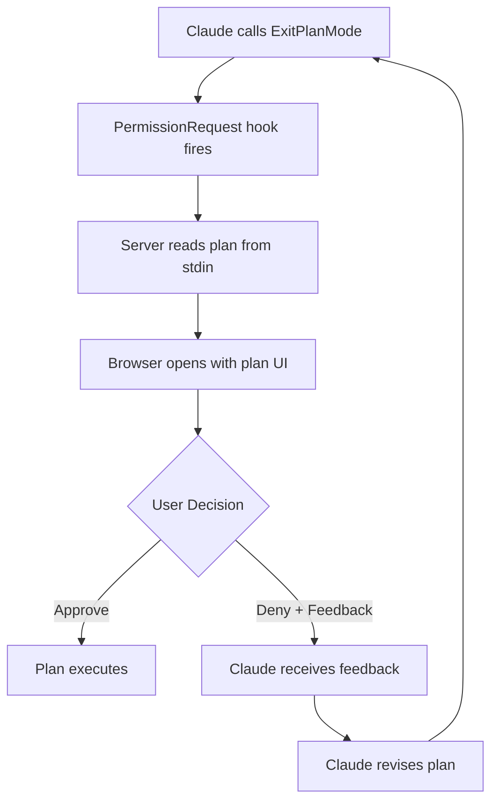

The Plan Review feature automatically intercepts Claude's `ExitPlanMode` permission requests and opens a visual UI for reviewing, annotating, and approving or denying plans.

## How It Works

When Claude completes planning and attempts to exit plan mode, Plannotator's hook system intercepts the request:



## Reviewing Plans

### Visual Interface

The plan review UI displays the plan as a beautifully rendered markdown document with:

- **Syntax highlighting** for code blocks (powered by highlight.js)
- **Responsive layout** with optimal reading width
- **Table of contents** sidebar for navigation (auto-opens based on settings)
- **Repository context** showing current branch and project name
- **Version history** with automatic plan versioning

### Reading Modes

The interface supports three annotation modes:

<Tabs>
  <Tab title="Selection Mode">
    The default mode. Select any text to see a floating toolbar with annotation options:
    - **Comment** - Add contextual feedback
    - **Delete** - Mark text for removal
    - **Replace** - Suggest alternative text
    - **Insert** - Add new content after selection
  </Tab>
  
  <Tab title="Comment Mode">
    Optimized for adding multiple comments quickly. Select text and it automatically creates a comment annotation without showing the toolbar.
  </Tab>
  
  <Tab title="Redline Mode">
    Track changes style. Any text you select is automatically marked for deletion, perfect for rapid document review.
  </Tab>
</Tabs>

## Annotation Types

Plannotator supports five annotation types defined in `packages/ui/types.ts:1`:

```typescript
enum AnnotationType {
  DELETION = 'DELETION',        // Mark text for removal
  INSERTION = 'INSERTION',      // Add new content
  REPLACEMENT = 'REPLACEMENT',  // Suggest alternative text
  COMMENT = 'COMMENT',          // Add feedback without changes
  GLOBAL_COMMENT = 'GLOBAL_COMMENT' // Plan-level feedback
}
```

### Creating Annotations

<Steps>
  <Step title="Select Text">
    Highlight the text you want to annotate. For code blocks, use manual selection (web-highlighter doesn't work inside `<pre>` tags).
  </Step>
  
  <Step title="Choose Action">
    Click the appropriate button in the floating toolbar:
    - **Comment**: Add explanatory feedback
    - **Delete**: Remove unnecessary content
    - **Replace**: Provide alternative wording
    - **Insert After**: Add missing content
  </Step>
  
  <Step title="Add Details">
    Enter your feedback text. For replacements and insertions, provide the new content.
  </Step>
  
  <Step title="Attach Images (Optional)">
    Click the image icon to attach screenshots, diagrams, or mockups with human-readable names like "login-mockup" or "error-state".
  </Step>
</Steps>

<Info>
  **Image Attachments**: Images are stored as temporary files and referenced by name in feedback. When sent to Claude, they appear as: `[image-name] /tmp/path...`
</Info>

### Global Comments

For feedback that doesn't relate to specific text:

1. Click the **Global Comment** button in the toolbar
2. Enter plan-level feedback (e.g., "Consider error handling", "Missing authentication step")
3. Attach reference images if helpful

## Annotation Structure

Each annotation contains metadata for precise text anchoring (from `packages/ui/types.ts:16`):

```typescript
interface Annotation {
  id: string;
  blockId: string;           // Legacy - not used with web-highlighter
  startOffset: number;       // Character offset in block
  endOffset: number;
  type: AnnotationType;
  text?: string;             // Comment/replacement/insertion text
  originalText: string;      // Selected text
  createdAt: number;         // Timestamp
  author?: string;           // For collaborative reviews
  images?: ImageAttachment[]; // Named image attachments
  // Cross-element selection metadata
  startMeta?: {
    parentTagName: string;
    parentIndex: number;
    textOffset: number;
  };
  endMeta?: {
    parentTagName: string;
    parentIndex: number;
    textOffset: number;
  };
}
```

## Making Decisions

### Approving Plans

Click the **Approve** button to allow plan execution. Optional actions:

- **Save Plan**: Store a snapshot to `~/.plannotator/plans/` (configure path in settings)
- **Send to Obsidian**: Export to an Obsidian vault as a markdown note
- **Send to Bear**: Create a Bear note with project tags
- **Include Feedback**: Send approval with constructive comments
- **Agent Switch** (OpenCode only): Switch to a different agent after approval

<Note>
  **Version History**: Plans are automatically saved to `~/.plannotator/history/{project}/{slug}/` regardless of the "Save Plan" setting. This powers version tracking and diff features.
</Note>

### Denying Plans

Click the **Deny** button to reject the plan and send it back to Claude:

1. Your annotations are exported to human-readable feedback via `exportAnnotations()` in `packages/ui/utils/parser.ts`
2. Claude receives the denial message with all feedback
3. Claude revises the plan based on your input
4. The updated plan triggers a new review (with diff tracking)

<Warning>
  **Be Specific**: Include clear, actionable feedback in your annotations. Vague comments like "fix this" won't help Claude improve the plan.
</Warning>

## Version History & Plan Diff

Every plan submission is automatically versioned in `~/.plannotator/history/{project}/{slug}/`:

- **Slug format**: `{sanitized-heading}-YYYY-MM-DD`
- **Versioning**: Sequential numbering (`001.md`, `002.md`, etc.)
- **Deduplication**: Identical resubmissions don't create new versions
- **Scope**: Per-project (git repo name or current directory)

See [Plan Diff Tracking](/features/plan-diff) for details on comparing versions.

## Settings

Access settings via the gear icon in the toolbar:

### Identity
Set your name for annotation authorship in collaborative reviews.

### Plan Saving
- **Enable/disable** decision snapshots
- **Custom path** for saved plans (default: `~/.plannotator/plans/`)
- Applies to approve/deny actions only (version history is always saved)

### Sidebar Behavior
- **Auto-open sidebar**: Table of Contents opens automatically on load
- Manual toggle always available via the sidebar button

### Agent Switching (OpenCode only)
- Configure post-approval agent switching
- See OpenCode plugin documentation for details

<Tip>
  **Persistent Settings**: Settings are stored in cookies (not localStorage) because each hook invocation runs on a random port. They persist across all plan reviews.
</Tip>

## Sharing Plans

Share plans with annotations via URL for collaboration:

1. Click the **Share** button in the toolbar
2. Plan + annotations are compressed using deflate and base64-encoded
3. For large plans, optionally create a short URL via the paste service
4. Recipients see the plan with your annotations in read-only mode

### Share Payload Format

From `packages/ui/utils/sharing.ts`:

```typescript
interface SharePayload {
  p: string;                    // Plan markdown
  a: ShareableAnnotation[];     // Compact annotations
  g?: ShareableImage[];         // Global attachments
}

type ShareableAnnotation =
  | ["D", string, string | null, ShareableImage[]?]           // Deletion
  | ["R", string, string, string | null, ShareableImage[]?]   // Replacement
  | ["C", string, string, string | null, ShareableImage[]?]   // Comment
  | ["I", string, string, string | null, ShareableImage[]?]   // Insertion
  | ["G", string, string | null, ShareableImage[]?];          // Global
```

<Info>
  **Privacy**: Shared URLs contain the full plan content. For sensitive plans, share the URL only with trusted collaborators or use a self-hosted paste service.
</Info>

## API Endpoints

The plan server (`packages/server/index.ts`) provides these endpoints:

| Endpoint | Method | Purpose |
|----------|--------|--------|
| `/api/plan` | GET | Returns `{ plan, origin, previousPlan, versionInfo }` |
| `/api/plan/version` | GET | Fetch specific version (`?v=N`) |
| `/api/plan/versions` | GET | List all versions of current plan |
| `/api/plan/history` | GET | List all plans in current project |
| `/api/approve` | POST | Approve plan with options (planSave, integrations, feedback) |
| `/api/deny` | POST | Deny plan with feedback |
| `/api/image` | GET | Serve image by path query param |
| `/api/upload` | POST | Upload image, returns `{ path, originalName }` |
| `/api/plan/vscode-diff` | POST | Open diff in VS Code editor |

## Remote Sessions

For SSH/devcontainer environments, set `PLANNOTATOR_REMOTE=1`:

```bash
export PLANNOTATOR_REMOTE=1
export PLANNOTATOR_PORT=19432  # Optional: use fixed port
```

The server will:
- Use a fixed port (default: 19432)
- Skip automatic browser opening
- Display a shareable URL for accessing the UI

<Note>
  **Port Forwarding**: Make sure to forward the port from your remote session to access the UI locally.
</Note>

## Keyboard Shortcuts

- **Escape**: Deselect current annotation
- **Click outside**: Clear text selection and hide toolbar
- **Sidebar toggle**: Click the sidebar button or use the TOC/Version tabs

## Troubleshooting

### Annotations Not Appearing

- Check that text selection is active before clicking annotation type
- For code blocks, ensure you're selecting rendered text (not raw markdown)
- Clear any existing selection and try again

### Share URL Too Long

- Use the short URL option via the paste service
- The server will prompt you to confirm before uploading
- Default paste service: `https://plannotator-paste.plannotator.workers.dev`

### Browser Not Opening

- Check `PLANNOTATOR_BROWSER` environment variable if using custom browser
- Verify browser is installed and accessible
- In remote mode, use the displayed URL instead of automatic opening

## Next Steps

- Learn about [Plan Diff Tracking](/features/plan-diff) to compare versions
- Explore [Code Review](/features/code-review) for reviewing git diffs
- Try [Markdown Annotation](/features/markdown-annotation) for arbitrary files